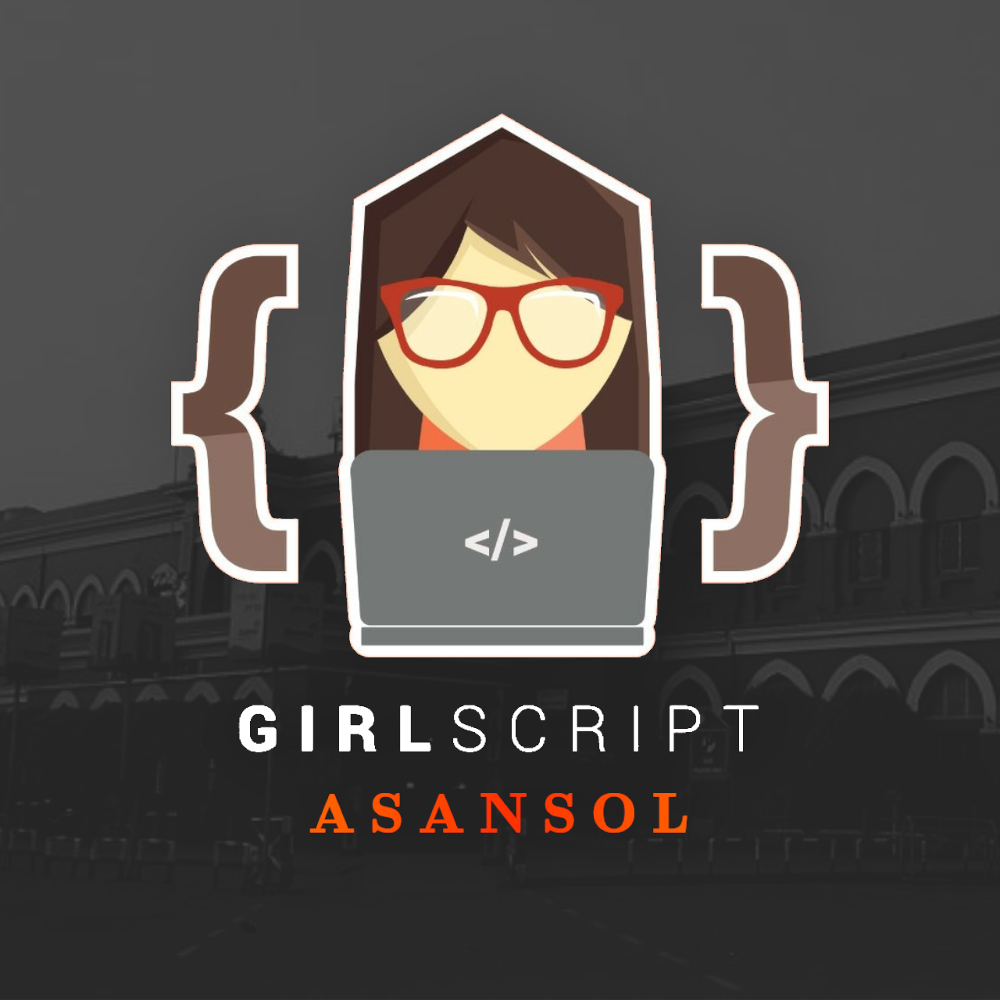
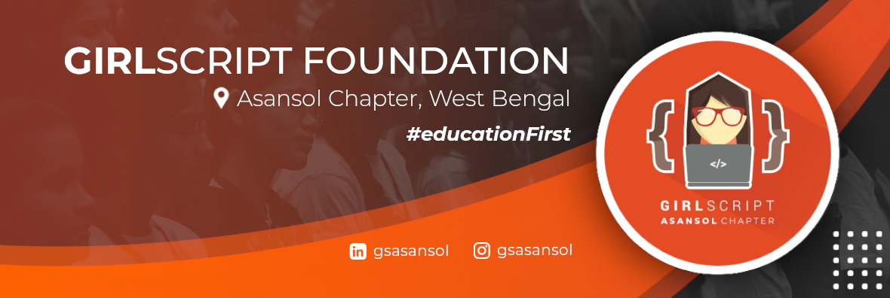
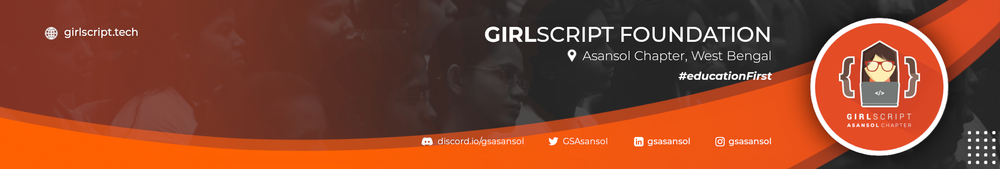
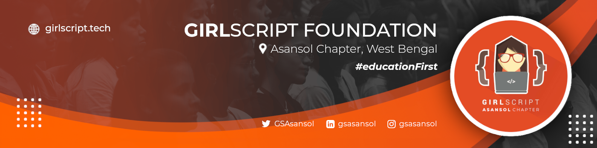

<h1 align="center">GirlScript Asansol Branding Assets</h1>

Community brand assets for GS Asansol Chapter

## About GirlScript Asansol 🚀

GirlScript Asansol's mission is to create opportunity, learning, growth and diversity in technology academia and industry.

## Assets in the Repository

| Resource |    Type   |  Dimension  | Preview |
| :------: | :-------: | :---------: | :-----: |
| Logo   | PNG       | 1280 x 1280 |  |
| Banner (Twitter) | PNG       | 1180 x 396 |  |
| Banner (LinkedIn Company)  | PNG       | 2340 x 396 |  |
| Banner (LinkedIn Personal) | PNG       | 1584 x 396 |  |

## Social

  
  &nbsp
  
  &nbsp
  
  &nbsp
  

  
## License

[`Unlicense`](LICENSE)
